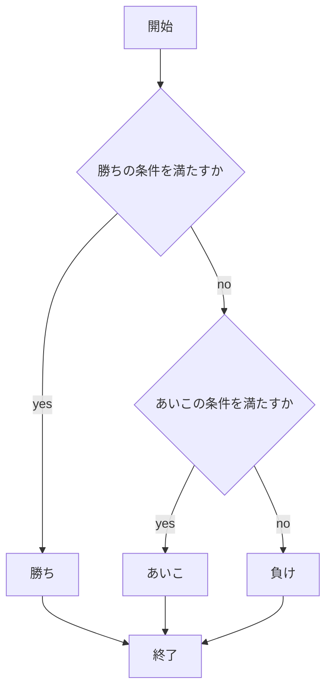
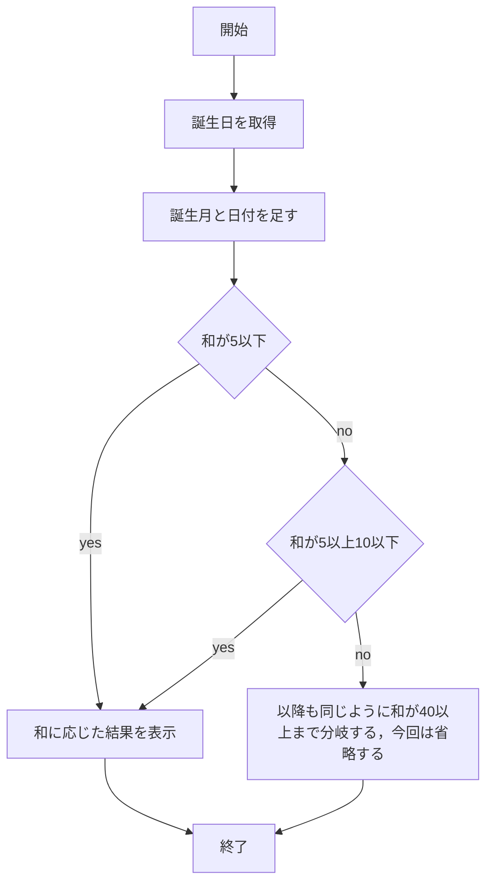
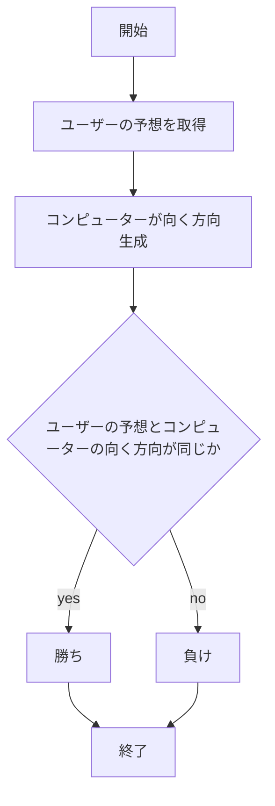

# webpro_06


## 文字の表示プログラム
### ファイル一覧
ファイル名| 説明
-|-
app5.js|プログラム本体
views/show.ejs | 文字表示のテンプレートファイル
### 使用方法
1. ターミナルで```node app5.js```を実行しサーバーを起動する．
1. Webブラウザで```localhost:8080/public/hello1.html```にアクセスする
###　機能の説明
このプログラムはアクセスすると挨拶が表示されるプログラムである．
アクセスされたらmessage1，message2として定義した挨拶をshow.ejsに渡し，テンプレート内でgreet1とgreet2として表示する．


## 文字の表示プログラム２
### ファイル一覧
ファイル名| 説明
-|-
app5.js|プログラム本体
views/show.ejs | 文字表示のテンプレートファイル
### 使用方法
1. ターミナルで```node app5.js```を実行しサーバーを起動する．
1. Webブラウザで```localhost:8080/public/hello2.html```にアクセスする
###　機能の説明
このプログラムはアクセスすると挨拶が表示されるプログラムである．
アクセスされたらgreet1とgreet2にそれぞれ定義された挨拶をshow.ejsに渡し，画面に表示する．


## アイコン表示プログラム
### ファイル一覧
ファイル名| 説明
-|-
app5.js|プログラム本体
views/icon.ejs | アイコン表示のテンプレートファイル
### 使用方法
1. ターミナルで```node app5.js```を実行しサーバーを起動する．
1. Webブラウザで```localhost:8080/public/luck.html```にアクセスする

###　機能の説明
このプログラムはアクセスすると設定した画像が表示されるプログラムである．
アクセスされたら，publicの中に保存されたApple_logo_black.svgを表示する．


## おみくじプログラム
### ファイル一覧
ファイル名| 説明
-|-
app5.js|プログラム本体
views/luck.ejs | おみくじのテンプレートファイル
### 使用方法
1. ターミナルで```node app5.js```を実行しサーバーを起動する．
1. Webブラウザで```localhost:8080/public/luck.html```にアクセスする

###　機能の説明
このプログラムはおみくじを行うプログラムである．
アクセスするたびにコンピューターはランダムに1〜6の数値を設定し，その値に対応して1なら大吉，2なら中吉のように運勢を表示する．


## じゃんけんプログラム
### ファイル一覧

ファイル名| 説明
-|-
app5.js|プログラム本体
public/janken.html | じゃんけんの開始画面
views/janken.ejs | じゃんけんのテンプレートファイル

### 使用方法
1. ターミナルで```node app5.js```を実行しサーバーを起動する．
1. Webブラウザで```localhost:8080/public/janken.html```にアクセスする
1. 自分がじゃんけんでなんの手を出すかを打ち込み，実行する．


###　機能の説明
このプログラムはじゃんけんを行うプログラムである．
1. 入力
ユーザーはグー，チョキ，パーのいずれかを送信する．
```GET```メゾットを使用して値を取得する．
1. 処理
ユーザーの手が取得できたらコンピューターはランダムに出す手を決める．
ユーザーの手とコンピューターの手を比較し，勝ちの条件を満たしていれば「勝ち」，同じ手であれば「あいこ」，それ以外であれば「負け」として結果を判定する．
1. 出力
判定された結果とユーザーの手，コンピューターの手，勝数を画面に表示する．




##　占いプログラム
### ファイル一覧
ファイル名| 説明
-|-
app5.js|プログラム本体
views/uranai.ejs | 占いのテンプレートファイル


###　使用方法
1. ターミナルで```node app5.js```を実行しサーバーを起動する．
1. Webブラウザで```localhost:8080/public/uranai.html```にアクセスする
1. 誕生日を入力し"占う"ボタンを押す．


###　機能の説明

このプログラムは，入力された誕生日からユーザーの運勢を占い表示するものである．
ユーザーが入力した誕生日の「月」と「日」を数値として取得し，それらを合計した値に基づいて運勢を判定し画面に表示するまでを行う．
以下のような手順で動いている．

1. 入力
ユーザーは誕生日を送信する．
```date```オブジェクトを使用してユーザーから誕生日のデータを取得する．
1. 処理
```date.getMonth()```，```date.getDate()```メゾットを利用して先程取得したデータから誕生月と日付を取得する．
この2つの値を足す．
if文を利用してこの和がどの範囲に収まるか判定し運勢を決め，表示する．
if文は和が5増えるごとに異なる結果を返すように設定されている．
1. 出力
判定された運勢と、入力された誕生日を画面に表示する．





## あっち向いてホイプログラム
### ファイル一覧
ファイル名| 説明
-|-
app5.js|プログラム本体
views/hoi.ejs | あっち向いてホイのテンプレートファイル

### 使用方法
1.ターミナルで ```node app5.js```を起動する
1. Webブラウザで```localhost:8080/public/hoi.html```にアクセスする
1. コンピューターが向く方向の予想を上下右左の4択から予想して，"ホイ！！"を押す．


### 機能の説明
このプログラムはあっち向いてホイを行うプログラムである．
ゲームのあと勝ち負けを判定し画面に表示するまでを行う．
このプログラムは以下の手順で動いている．
1. 入力
ユーザーはボタンを押すことでコンピューターの向く方向の予想を送信する．
ラジオボタンからユーザーの予想を取得する．取得には```GET```メゾットを使用する．
1. 処理
ユーザーの予想が取得できたら，コンピューターはランダムに向く方向を選ぶ．
ユーザーの予想とコンピューターの向く方向を比較し，一致すれば「勝ち」，しなければ「負け」として結果を判定する．
1. 出力
判定された結果とユーザーの予想，コンピューターの向いた方向，勝数を画面に表示する．


