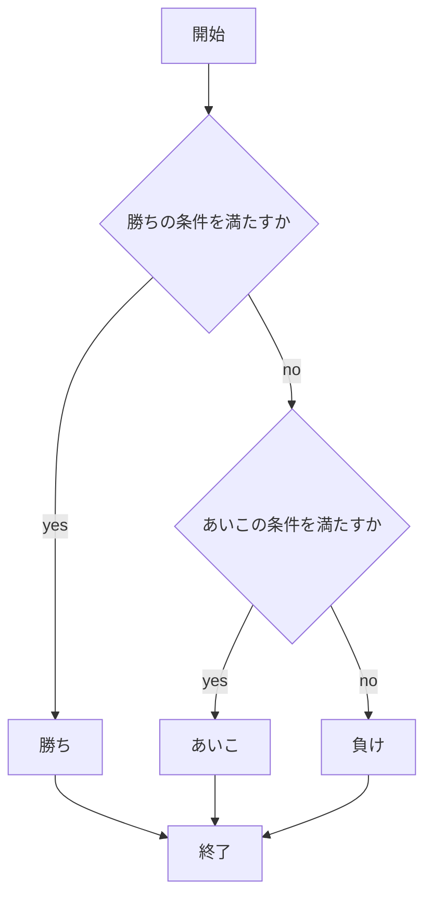

# webpro_06
## このプログラムについて
## ファイル一覧

ファイル名| 説明
-|-
app5.js|プログラム本体
public/janken.html | じゃんけんの開始画面
views/janken.ejs | じゃんけんのテンプレートファイル

## 使用方法
1. ```node app5.js```を起動する
1. Webブラウザで```localhost:8080/public/janken.html```にアクセスする
1. 自分の手を入力する



##　占いプログラムについて
ファイル名| 説明
-|-
app5.js|プログラム本体
views/uranai.ejs | 占いのテンプレートファイル

##　使用方法
1. ```node app5.js```を起動する
1. Webブラウザで```localhost:8080/public/uranai.html```にアクセスする
1. 自分の星座を入力する

```mermaid
flowchart TD;

start["開始"]
end["終了"]
make["ランダムな数字を割り当てる"]
p1["運勢は★５"]
p2["運勢は★４"]


start --> make
make -->|数字が１| p1
p1 --> end
make -->|数字が2| p2
p2 --> end

```
